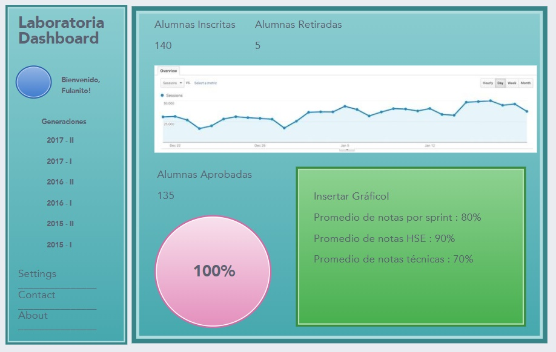

# Dashboard - Laboratoria

### Objetivo:

En el dashboard, los usuarios mencionados pueden ver rápidamente estadísticas y datos en tiempo real como:

- Número de alumnas inscritas.
- Número de alumnas que desertaron.
- Número y % de alumnas que pasan el criterio mínimo de evaluación.
- Promedio de notas por sprint.
- Promedio de notas HSE.
- Promedio de notas técnicas.

Además, dado que Laboratoria tiene muchas generaciones, regularmente 2 generaciones por año (estas generaciones empezaron en el 2014), y que opera en 4 sedes (Arequipa, Ciudad de México, Lima y Santiago de Chile), es posible que los usuarios quieran ver datos de sedes / generaciones anteriores para poder hacer comparaciones.

Elaborar un Dashboard con los datos mencionados anteriormente

- Haciendo click en cada generación, aparecen los datos respectivos a cada grupo de alumnas.
